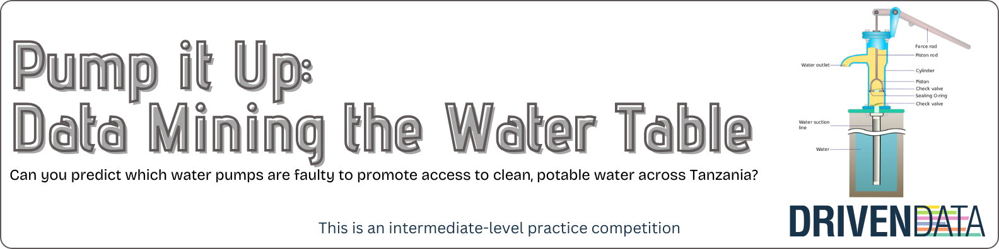

  

# Predicción del estado de bombas de agua en Tanzania 🚰

Hola 👋, en este repositorio les presento un ejercicio muy interesante que realicé para una de las asignaciones en el máster. Participamos individualmente en una competencia de [Drivendata](https://www.drivendata.org/competitions/7/pump-it-up-data-mining-the-water-table/page/23/), la cual tenía el objetivo de predecir el estado de unas bombas de agua en Tanzania 🇹🇿. Cuando participamos la fecha final de la competencia era aproxamadamente Febrero de este año (2024), ahora veo que la fecha se extendió para Octubre (2024). El máximo puntaje (Classification Rate) hoy en día está en **0.8294**.

El puntaje que obtuve fue **0.8123**, en ese entonces (Septiembre 2023) ocupé la posición **3102** en la competencia. El modelo que utilicé fue un Random Forest 🌳, sin conocer en aquel momento las Redes Neuronales.

En términos generales, acerca del código en Python, resalto el uso de la librería `missingno` para visualizar registros nulos, la librería `IterativeImputer` para imputar registros nulos considerando la información que puedan aportar las otras variables del conjunto de datos, y la librería `SMOTE` (sí, esa que muchos odian 😅) para generar registros sintéticos dado el gran desbalance de las clases contenidas en la variable objetivo.

**⚠️🚧ESPERA PRONTO LA ACTUALIZACIÓN DE ESTE REPOSITORIO 🚧⚠️**